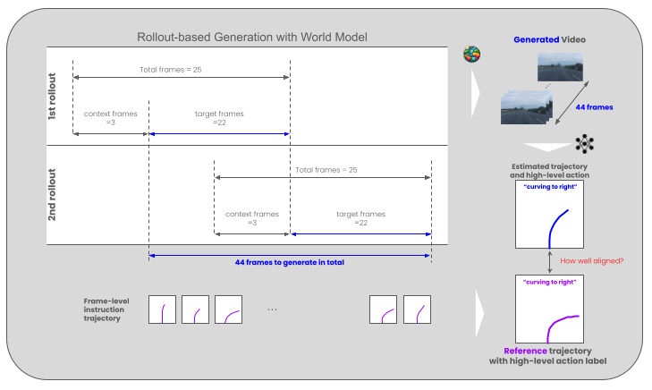

# ACT-Bench

ACT-Bench is a dedicated framework for quantitatively evaluating the action controllability of world models for autonomous driving. It focuses on measuring how well a world model can generate driving scenes conditioned on specified trajectories.



## Get Started

To begin with, you want to setup the `ACT-Bench` by running the following commands:

```bash
git clone https://github.com/turingmotors/ACT-Bench.git
cd ACT-Bench

# Install dependencies via uv
uv sync
# Or, via pip
pip install -e .

source .venv/bin/activate
```

## Evaluate Action Controllability

### 1. Generate Videos with World Model on the Benchmark Dataset

Note that `instruction_trajs` may not be directly usable as-is; you will need to tailor it to match the input format required by specific world models.
For an example, see the prepare_action() function in Terra/generate.py.

Once videos are generated, arrange them at `generated_videos/<your_model_name>/NUSCENES_ACTION_*.mp4`.
The number of mp4 files in the directory must be the same as the number of samples in the benchmark dataset, which is 2286.
We also provide a script to generate videos with Terra and Vista models, see [Generate Videos with Terra](./Terra/README.md).

### 2. Compute Scores with ACT-Estimator

```bash
python run_benchmark.py --input_dir generated_videos/<your_model_name> --output_dir results/<your_model_name>
```

See `python run_benchmark.py --help` for more details.

Or, you can write a script to evaluate your generated videos:

```python
from act_bench import ActBenchConfig, compute_score

config = ActBenchConfig(
    input_dir="generated_videos/<your_model_name>",
    output_dir="results/<your_model_name>",
)
results = compute_score(config)
print(f"Accuracy: {results.accuracy*100:.2f}%")
print(f"Mean ADE: {results.ade:.4f}, Mean FDE: {results.fde:.4f}")
```

## Reproduce Numbers in the Paper

First, you have to download the generated videos from huggingface hub with the following command:

```bash
python download_generated_videos.py
```

This will download the generated videos under the `generated_videos/` directory, which are the same as the ones evaluated in our paper.
So, the scores in the paper can be reproduced by running the following command:

```bash
# For Terra
./scripts/compute_score_terra_paper.sh

# For Vista
./scripts/compute_score_vista_paper.sh
```

Also, a notebook example is also provided to reproduce the numbers: [compute_score.ipynb](notebook/compute_score.ipynb).

## Citation

If any parts of our paper and code help your research, please consider citing us and giving a star to our repository.

```bibtex
@misc{arai2024actbench,
      title={ACT-Bench: Towards Action Controllable World Models for Autonomous Driving},
      author={Hidehisa Arai and Keishi Ishihara and Tsubasa Takahashi and Yu Yamaguchi},
      year={2024},
      eprint={2412.05337},
      archivePrefix={arXiv},
      primaryClass={cs.CV},
      url={https://arxiv.org/abs/2412.05337},
}
```
