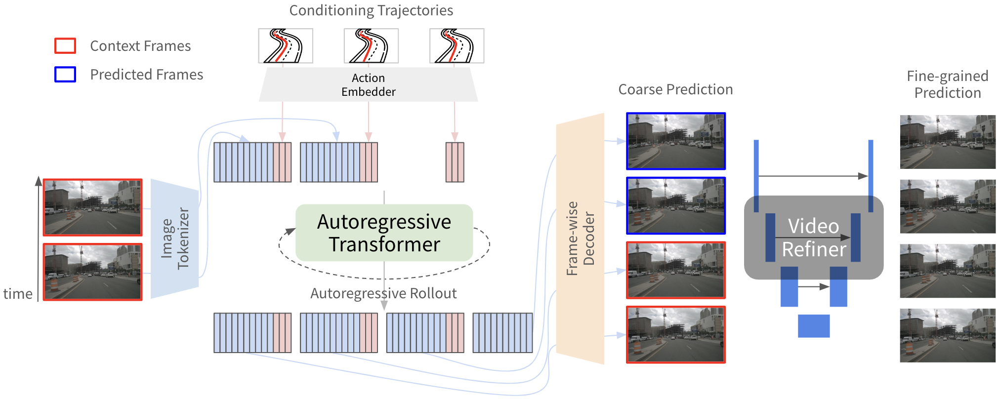

# Terra

**Terra** is a world model designed for autonomous driving and serves as a baseline model in th ACT-Bench framework. Terra generates video continuations based on short video clips of approximately three frames and trajectory instructions. A key feature of Terra is its **high adherence to trajectory instructions**, enabling accurate and reliable action-conditioned video generation.

More details are on [our paper](https://arxiv.org/abs/2412.05337).



## Installation

```shell
git clone https://github.com/turingmotors/ACT-Bench.git
cd ACT-Bench

# Install dependencies via uv
uv sync
# Or, via pip
pip install -e .

source .venv/bin/activate

cd Terra
```

If you’d like to speed up generation, we also provide a [vLLM](https://docs.vllm.ai/en/latest/) implementation that was used to produce the results reported in the paper. To use the vLLM implementation, install vLLM with the following command:

```shell
uv pip install vllm==0.6.3.post1
```

## Download pre-trained weights

Pre-trained weights of the Image Tokenizer and the Autoregressive Transformer will be automatically downloaded from [Hugging Face repository](https://huggingface.co/turing-motors/Terra) when you run `generate.py`, so no special preparation is required if you just want to try running it. However, if you plan to use the Video Refiner for generation, you will need to download the weights separately. Please follow the steps below to download it.

```shell
# assume you are in the directory where this README file is placed.
cd checkpoints
./download_weights.sh
cd ..
```

## How to generate videos using Terra

To generate videos with Terra, you need to prepare data formatted in the same way as the [ACT-Bench dataset](https://huggingface.co/datasets/turing-motors/ACT-Bench). For details on the format, please refer to this [link](https://huggingface.co/datasets/turing-motors/ACT-Bench#data-fields). However, since `reference_traj` and `intrinsic` are not used, they can be omitted.

All the following examples are based on the ACT-Bench dataset. To reproduce the steps below, you must first download the [nuscenes](https://www.nuscenes.org/nuscenes) dataset and the [ACT-Bench](https://huggingface.co/datasets/turing-motors/ACT-Bench) dataset. For the ACT-Bench dataset, make sure to explicitly place the JSONL file into your local environment using the following command (replacing < /path/to > with your desired local directory):

```shell
# replace the part enclosed with '<>'
huggingface-cli download --repo-type dataset turing-motors/ACT-Bench act_bench.jsonl --local-dir < /path/to >
```

### Generation settings with Video Refiner

```shell
python generate.py \
--image_root "/path/to/nuscenes" \
--annotation_file "/path/to/act_bench.jsonl" \
--output_dir ../generated_videos/Terra \
--decoding_method video_refiner \
--num_frames 47
```

Note that it takes approximately 5 minutes to generate a single sample on a single H100 80GB GPU. This means that generating videos for all 2,286 samples in the ACT-Bench dataset will take around 8 days (5 minutes/sample × 2,286 samples ÷ (60 minutes/hour × 24 hours/day)). To speed up the generation process, you can split the JSONL file into multiple parts and run the generation in parallel using multiple GPUs.

### Generation settings without Video Refiner

```shell
python generate.py \
--image_root "/path/to/nuscenes" \
--annotation_file "/path/to/act_bench.jsonl" \
--output_dir ../generated_videos/Terra \
--num_frames 47
```

### Speed up generation with vLLM

To use vLLM implementation, you first need to save the pre-trained weights locally:

```python
from transformers import AutoModel


AutoModel.from_pretrained("turing-motors/Terra", subfolder="world_model", trust_remote_code=True).save_pretrained("/path/to/save/directory")
```

Make sure to replace /path/to/save/directory with the directory where you want to store the model.

After saving the model, you can run the vLLM implementation as follows. Be sure to set --world_model_name to the directory where you saved the model in the previous step:

```shell
python generate.py \
--image_root "/path/to/nuscenes" \
--annotation_file "/path/to/act_bench.jsonl" \
--output_dir ../generated_videos/Terra \
--decoding_method video_refiner \
--num_frames 47 \
--vllm_impl \
--world_model_name /path/to/save/directory
```
